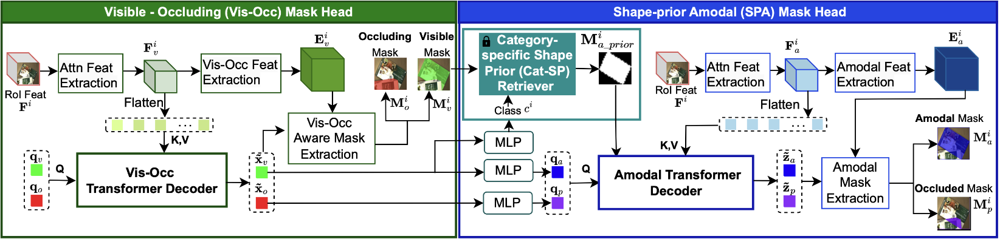

# Amodal Instance Segmentation with Transformer
Table of Contents
* [Introduction](#introduction)
* [Usage](#usage)
* [Citation](#citation)

## Introduction


The figure above illustrates our ShapeFormer architecture. The main implementation of this network can be found [here](shapeformer/mask_head.py).

## Usage
### 1. Installation
This work uses [aistron](https://github.com/trqminh/aistron/) for implementation. Please follow the instruction at [here](https://github.com/trqminh/aistron/blob/main/docs/INSTALL.md)

### 2. Data preparation
Please download the below datasets. More preparation instruction can be found [here](https://github.com/trqminh/aistron/blob/main/datasets/README.md).

#### 2.1. KINS dataset
Download the [Images](http://www.cvlibs.net/download.php?file=data_object_image_2.zip)
from [KITTI dataset](http://www.cvlibs.net/datasets/kitti/eval_object.php?obj_benchmark=2d). 

The [Amodal Annotations](https://drive.google.com/drive/folders/1FuXz1Rrv5rrGG4n7KcQHVWKvSyr3Tkyo?usp=sharing)
could be found at [KINS dataset](https://github.com/qqlu/Amodal-Instance-Segmentation-through-KINS-Dataset)

#### 2.2. D2SA dataset
The D2S Amodal dataset could be found at [mvtec-d2sa](https://www.mvtec.com/company/research/datasets/mvtec-d2s/).

#### 2.3. COCOA-cls dataset
The COCOA dataset annotation from [here](https://drive.google.com/file/d/1n1vvOaT701dAttxxGeMKQa7k9OD_Ds51/view) (reference from github.com/YihongSun/Bayesian-Amodal)
The images of COCOA dataset is the train2014 and val2014 of [COCO dataset](http://cocodataset.org/).


### 3. Training, Testing and Demo
Configuration files for training AISFormer on each datasets are available [here](configs/).
To train, test and run demo, see the example scripts at [`scripts/`](scripts/):


## Citation
```
@article{tran2024shapeformer,
  title={ShapeFormer: Shape Prior Visible-to-Amodal Transformer-based Amodal Instance Segmentation},
  author={Tran, Minh and Bounsavy, Winston and Vo, Khoa and Nguyen, Anh and Nguyen, Tri and Le, Ngan},
  journal={arXiv preprint arXiv:2403.11376},
  year={2024}
}
```
